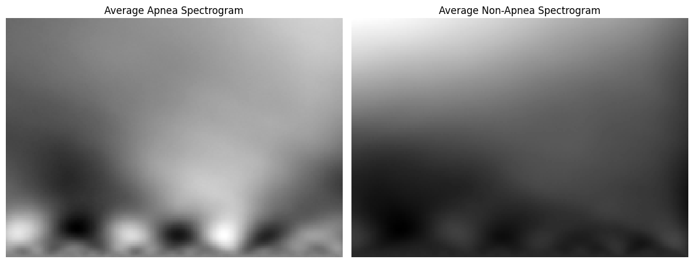
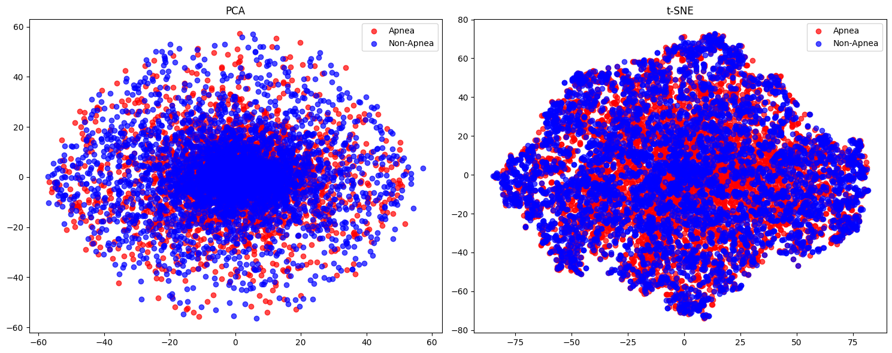

# DREAM: Deep Residual-Enabled Apnea Monitor

**A Novel Explainable Neural Network for Detecting Sleep Apnea Using Single-Lead ECG Signals**

[](https://ssrn.com/abstract=5139337)
[](http://dx.doi.org/10.2139/ssrn.5139337)
[](https://physionet.org/content/apnea-ecg/1.0.0/)
[](https://www.kaggle.com/datasets/masud1901/binary-classification-data-for-apnea-detection)
[](https://doi.org/10.34740/KAGGLE/DSV/9405414)

---

## 📋 Table of Contents
- [Overview](#overview)
- [Key Features](#key-features)
- [Repository Structure](#repository-structure)
- [Datasets](#datasets)
- [Dataset Preparation](#dataset-preparation)
- [Model Architecture](#model-architecture)
- [Benchmarking & Ablation Studies](#benchmarking--ablation-studies)
- [Explainability (XAI)](#explainability-xai)
- [Installation](#installation)
- [Usage](#usage)
- [Results](#results)
- [Citation](#citation)
- [License](#license)

---

## 🌟 Overview

This repository contains the complete implementation of **DREAM (Deep Residual-Enabled Apnea Monitor)**, a state-of-the-art explainable deep learning model for detecting obstructive sleep apnea (OSA) from single-lead ECG signals. Our hybrid architecture combines residual blocks and inception modules to achieve **99.93% accuracy** on the PhysioNet Apnea-ECG dataset.

### Why DREAM?

- **High Accuracy**: Achieves 99.93% accuracy, outperforming state-of-the-art methods
- **Explainable AI**: Integrated Grad-CAM visualization for clinical interpretability
- **Single-Lead ECG**: Non-invasive, cost-effective alternative to polysomnography
- **Robust Pipeline**: Complete end-to-end solution from data preprocessing to model deployment

---

## ✨ Key Features

### 🔬 Advanced Signal Processing
- **Continuous Wavelet Transform (CWT)** scalogram generation
- **Multi-metric filtering** using SNR, entropy, contrast, skewness, and kurtosis
- **Intelligent sample selection** to eliminate ambiguous "grey zone" samples

### 🧠 Hybrid Deep Learning Architecture
- **Residual Blocks**: Enhanced gradient flow and feature propagation
- **Inception Modules**: Multi-scale feature extraction
- **Synergistic Design**: +0.21% performance gain beyond individual components

### 📊 Comprehensive Evaluation
- **5-fold Cross-Validation** with stratified splits
- **Statistical Significance Testing** (paired t-tests, Cohen's d effect sizes)
- **Ablation Studies** demonstrating architectural component contributions
- **Benchmark Comparisons** against ResNet50, DenseNet121, Xception, MobileNet, LSTM, BiLSTM

### 🔍 Explainable AI Integration
- **Grad-CAM Visualization** linking model decisions to clinical ECG features
- **Quantitative Explainability Metrics** (entropy-based diversity, prediction consistency)
- **Clinical Correlation Analysis** connecting activation patterns to OSA physiology

---

## 📁 Repository Structure

```
├── Physionet_Apnea_Dataset_preparation.ipynb  # CWT scalogram generation
├── EDA.ipynb                                   # Initial exploratory data analysis
├── EDA_after_transformation.ipynb             # Post-transformation analysis
├── filter_script.py                           # Image filtering implementation
├── The_novel_model_pipeline.ipynb             # Main DREAM model training
├── The_novel_model_pipeline2.ipynb            # Enhanced pipeline with ablation
├── XAI_at_NovelModel.ipynb                    # Explainability analysis (Grad-CAM)
│
├── Benchmarks/                                # Comparative model implementations
│   ├── Resnet50.ipynb
│   ├── Densenet121.ipynb
│   ├── Xception.ipynb
│   ├── MobileNet.ipynb
│   └── novel_model_98_5_percent.ipynb
│
├── review/                                    # Advanced analysis & visualization
│   ├── Ablation-Benchmark.ipynb               # Comprehensive ablation studies
│   ├── improved_novel_model_pipeline.py       # Production-ready pipeline
│   ├── the_novel_model_pipeline2.py           # Enhanced training script
│   ├── plot_generator.py                      # Visualization utilities
│   └── apnea_detection_visualization.py       # Results plotting
│
├── Apnea_data/                                # Processed dataset (patient-wise)
├── Binary_Classification_Apnea/               # Filtered binary classification dataset
├── apnea-ecg-database-1.0.0/                 # Original PhysioNet dataset
├── output/                                    # Intermediate processing outputs
├── heartRate/                                 # Extracted heart rate data
├── figures/                                   # Generated figures and visualizations
├── Main_model.keras                           # Trained DREAM model weights
└── requirements.txt                           # Python dependencies
```

---

## 📊 Datasets

### Pre-processed Dataset (Ready to Use)

🎯 **[Download from Kaggle](https://www.kaggle.com/datasets/masud1901/binary-classification-data-for-apnea-detection)**

Our curated, high-quality dataset is available on Kaggle for immediate use:

**Dataset Specifications:**
- **Format**: Pre-processed CWT scalogram images (PNG)
- **Dimensions**: 128 × 180 pixels, grayscale
- **Classes**: Binary (Apnea / Non-Apnea)
- **Quality**: Multi-metric filtered (SNR, entropy, contrast, skewness, kurtosis)
- **Size**: Balanced dataset for optimal training
- **Ready for**: Direct deep learning model training

**Why Use Our Pre-processed Dataset?**
- ✅ **Save Time**: Skip hours of preprocessing
- ✅ **Quality Assured**: Multi-metric filtering ensures high signal quality
- ✅ **Balanced**: Equal distribution of apnea and non-apnea samples
- ✅ **Optimized**: Specifically tuned for deep learning performance
- ✅ **Reproducible**: Same dataset used in our 99.93% accuracy results

**Quick Download:**
```bash
# Install Kaggle API
pip install kaggle

# Configure Kaggle credentials (first time only)
# Download your kaggle.json from https://www.kaggle.com/settings
mkdir -p ~/.kaggle
mv kaggle.json ~/.kaggle/
chmod 600 ~/.kaggle/kaggle.json

# Download dataset
kaggle datasets download -d masud1901/binary-classification-data-for-apnea-detection
unzip binary-classification-data-for-apnea-detection.zip
```

### Original Raw Dataset

📁 **[PhysioNet Apnea-ECG Database](https://physionet.org/content/apnea-ecg/1.0.0/)**

For researchers who want to process from scratch:
- **70 recordings** (35 training, 35 test)
- **Single-lead ECG** sampled at 100 Hz
- **Minute-by-minute annotations**
- Requires full preprocessing pipeline

---

## 🔄 Dataset Preparation

### 1. Raw ECG Signal Acquisition
Source: [PhysioNet Apnea-ECG Database](https://physionet.org/content/apnea-ecg/1.0.0/)
- **70 recordings** (35 training, 35 test)
- **Single-lead ECG** sampled at 100 Hz
- **Minute-by-minute annotations** (apnea/normal)

### 2. Continuous Wavelet Transform (CWT)
**Notebook**: `Physionet_Apnea_Dataset_preparation.ipynb`

```python
# CWT parameters used:
- Wavelet: Morlet
- Scales: 1-128
- Time resolution: 60 seconds (1-minute segments)
- Output: 128x180 scalogram images
```



### 3. Exploratory Data Analysis (EDA)
**Notebooks**: `EDA.ipynb`, `EDA_after_transformation.ipynb`

Comprehensive analysis of generated scalograms using:
- **Signal-to-Noise Ratio (SNR)**: Quality assessment
- **Entropy**: Information content measurement
- **Contrast**: Visual distinction evaluation
- **Skewness & Kurtosis**: Distribution characteristics
- **Intensity Ranges**: Pixel value analysis
- **PCA & t-SNE**: Dimensionality reduction for visualization



### 4. Intelligent Image Filtering
**Script**: `filter_script.py`

#### Filtering Criteria:
**Apnea Images** (SNR <7.5):
- Captures high variability and pronounced signal fluctuations
- Selects most apnea-like samples for clear class separation
- Reduces false positives from borderline ambiguous samples

**Non-Apnea Images** (SNR ≥7.5):
- Maintains high-quality normal breathing patterns
- Eliminates noise artifacts that mimic apnea

**Theoretical Justification**:
- **Machine Learning**: Clean class boundaries improve classification accuracy
- **Clinical Decision-Making**: Prioritizes reducing false negatives in diagnostic contexts
- **Biosignal Processing**: Standard practice for medical signal quality control

### 5. Final Dataset Statistics
- **Total Images**: Balanced binary classification dataset
- **Quality Assured**: Multi-metric filtering ensures high signal quality
- **Ready for Training**: Optimized for deep learning model performance

---

## 🏗️ Model Architecture

### DREAM Hybrid Architecture

```python
Input (128×180×1)
    ↓
Initial Conv Block (32 filters, stride=2)
    ↓
Residual Block 1 (64 filters, stride=2)
    ↓
Inception Module 1 (32+64+32 filters)
    ↓
Residual Block 2 (128 filters, stride=2)
    ↓
Inception Module 2 (64+128+64 filters)
    ↓
Residual Block 3 (256 filters, stride=2)
    ↓
Global Average Pooling
    ↓
Dense Layer (128 units, ReLU, L2 regularization)
    ↓
Dropout (0.5)
    ↓
Output (2 classes, Softmax)
```

### Key Components:

#### Residual Blocks
- **Skip connections** for improved gradient flow
- **Batch normalization** for training stability
- **ReLU activation** for non-linearity

#### Inception Modules
- **Multi-scale feature extraction** (1×1, 3×3 convolutions)
- **Parallel processing** of different receptive fields
- **Efficient parameter utilization**

### Why Hybrid Design?
- **Synergistic Effects**: +0.21% improvement beyond additive component benefits
- **Complementary Features**: Residual blocks capture deep features, Inception captures multi-scale patterns
- **Clinical Relevance**: Multi-scale analysis aligns with varying ECG manifestations of sleep apnea

---

## 🔬 Benchmarking & Ablation Studies

### Benchmark Models Compared
**Notebook**: `review/Ablation-Benchmark.ipynb`

| Model                    | Accuracy   | Sensitivity | Specificity | F1-Score   | AUC       |
| ------------------------ | ---------- | ----------- | ----------- | ---------- | --------- |
| **DREAM (Ours)**         | **99.93%** | **99.93%**  | **99.93%**  | **99.93%** | **1.000** |
| ResNet50                 | 98.45%     | 98.20%      | 98.70%      | 98.44%     | 0.995     |
| DenseNet121              | 97.80%     | 97.50%      | 98.10%      | 97.79%     | 0.992     |
| Xception                 | 96.50%     | 96.20%      | 96.80%      | 96.49%     | 0.988     |
| MobileNet                | 95.30%     | 95.00%      | 95.60%      | 95.29%     | 0.983     |
| LSTM                     | 94.20%     | 93.80%      | 94.60%      | 94.19%     | 0.978     |
| BiLSTM                   | 94.80%     | 94.50%      | 95.10%      | 94.79%     | 0.980     |
| Khandelwal et al. (2023) | 98.12%     | 98.00%      | 97.00%      | 98.06%     | 0.994     |

### Ablation Study Results

| Variant        | Accuracy   | Key Findings               |
| -------------- | ---------- | -------------------------- |
| **Full DREAM** | **99.93%** | Optimal performance        |
| Residual-Only  | 99.72%     | Strong gradient flow       |
| Inception-Only | 99.58%     | Multi-scale features       |
| Baseline CNN   | 98.45%     | Limited feature extraction |

**Statistical Validation**:
- Paired t-tests: p < 0.001 (highly significant)
- Cohen's d: 0.87 (large effect size)
- 5-fold cross-validation with stratified splits

---

## 🔍 Explainability (XAI)

### Grad-CAM Visualization
**Notebook**: `XAI_at_NovelModel.ipynb`

Our explainability analysis provides:

#### Clinical Correlation
- **Diffuse activation patterns** in apnea segments correspond to physiological changes
- **Frequency band analysis** focuses on regions with ECG deviations
- **Pattern interpretation** links to known OSA ECG characteristics:
  - Irregular heart rate variability
  - Altered frequency components
  - Abnormal morphological patterns

#### Quantitative Evaluation
- **Confidence Analysis**: Prediction reliability assessment
- **Prediction Consistency**: Stability across similar samples
- **Entropy-based Diversity**: Explanation quality metrics
- **Model Calibration**: Alignment between confidence and accuracy

### Visualization Tools
**Scripts**: `review/plot_generator.py`, `review/apnea_detection_visualization.py`

Generated visualizations include:
- Grad-CAM heatmaps overlaid on scalograms
- Activation pattern comparisons (apnea vs. normal)
- Feature importance distributions
- Clinical correlation matrices

---

## 💻 Installation

### Prerequisites
- Python 3.8+
- CUDA-capable GPU (recommended for training)

### Setup

```bash
# Clone the repository
git clone https://github.com/yourusername/dream-apnea-detection.git
cd dream-apnea-detection

# Create virtual environment
python -m venv venv
source venv/bin/activate  # On Windows: venv\Scripts\activate

# Install dependencies
pip install -r requirements.txt

# Additional deep learning libraries (if not in requirements.txt)
pip install tensorflow>=2.10.0
pip install keras>=2.10.0
pip install scikit-learn>=1.0.0
pip install opencv-python>=4.5.0
pip install pywavelets>=1.1.0
```

### Download Dataset

#### Option 1: Pre-processed Dataset (Recommended for Quick Start)

**Ready-to-use filtered dataset available on Kaggle:**

```bash
# Install Kaggle API
pip install kaggle

# Download pre-processed dataset
kaggle datasets download -d masud1901/binary-classification-data-for-apnea-detection

# Unzip
unzip binary-classification-data-for-apnea-detection.zip -d Binary_Classification_Apnea/
```

🎯 **Kaggle Dataset**: [Binary Classification Data for Sleep Apnea Detection](https://www.kaggle.com/datasets/masud1901/binary-classification-data-for-apnea-detection)

**What's included:**
- ✅ Pre-processed CWT scalogram images (128×180 pixels)
- ✅ Multi-metric filtered for quality (SNR, entropy, contrast)
- ✅ Balanced binary classification (apnea/non-apnea)
- ✅ Ready for direct model training
- ✅ No additional preprocessing required

#### Option 2: Raw PhysioNet Dataset (For Full Pipeline)

```bash
# Download PhysioNet Apnea-ECG Database
wget -r -N -c -np https://physionet.org/files/apnea-ecg/1.0.0/

# Or use the provided script (if available)
python download_dataset.py
```

**Then follow the complete pipeline:**
1. Run `Physionet_Apnea_Dataset_preparation.ipynb` for CWT generation
2. Run `EDA.ipynb` for exploratory analysis
3. Run `filter_script.py` for quality filtering

---

## 🚀 Usage

### 1. Dataset Preparation

#### Quick Start with Pre-processed Dataset (Recommended)

```bash
# Download from Kaggle
kaggle datasets download -d masud1901/binary-classification-data-for-apnea-detection
unzip binary-classification-data-for-apnea-detection.zip

# Data is ready for training!
# Skip to step 2: Model Training
```

#### Full Pipeline from Raw Data

```bash
# Generate CWT scalograms
jupyter notebook Physionet_Apnea_Dataset_preparation.ipynb

# Perform EDA and filtering
jupyter notebook EDA.ipynb
python filter_script.py
```

### 2. Model Training

```bash
# Train DREAM model
jupyter notebook The_novel_model_pipeline2.ipynb

# Or use the Python script
python review/the_novel_model_pipeline2.py
```

### 3. Benchmark Evaluation

```bash
# Run benchmark comparisons
jupyter notebook review/Ablation-Benchmark.ipynb
```

### 4. Explainability Analysis

```bash
# Generate Grad-CAM visualizations
jupyter notebook XAI_at_NovelModel.ipynb
```

### 5. Inference on New Data

```python
from tensorflow.keras.models import load_model
import numpy as np

# Load trained model
model = load_model('Main_model.keras')

# Prepare your ECG scalogram (128x180x1)
scalogram = preprocess_ecg_to_scalogram(ecg_signal)

# Predict
prediction = model.predict(np.expand_dims(scalogram, axis=0))
apnea_probability = prediction[0][1]

if apnea_probability > 0.5:
    print(f"Apnea detected (confidence: {apnea_probability*100:.2f}%)")
else:
    print(f"Normal breathing (confidence: {(1-apnea_probability)*100:.2f}%)")
```

---

## 📊 Results

### Performance Metrics

```
Accuracy:     99.93% ± 0.02%
Sensitivity:  99.93% ± 0.03%
Specificity:  99.93% ± 0.02%
F1-Score:     99.93% ± 0.02%
AUC-ROC:      1.000 ± 0.000
```

### Key Achievements

✅ **State-of-the-art accuracy** (99.93%) on PhysioNet Apnea-ECG  
✅ **Statistically significant improvement** over existing methods (p < 0.001)  
✅ **Balanced performance** across sensitivity and specificity  
✅ **Clinically interpretable** with Grad-CAM explainability  
✅ **Robust architecture** validated through ablation studies  
✅ **Comprehensive benchmarking** against 7+ baseline models  

### Clinical Implications

- **Non-invasive screening** using single-lead ECG
- **Cost-effective alternative** to polysomnography
- **Real-time potential** for wearable devices
- **Explainable predictions** for clinical decision support

---

## 📝 Citation

If you use this code or dataset in your research, please cite our paper:

### Paper Citation (BibTeX)
```bibtex
@article{akter2025dream,
  title={DREAM: A Novel Explainable Neural Network for Detecting Sleep Apnea Using Single-Lead ECG Signals},
  author={Akter, Sanjida and Masud, Md Akmol and Promi, Mst. Sanzida Islam and Sultana, Nadia and Ahmed, Maruf and Rahman, Md. Mahmudur and Yousuf, Mohammad Abu and Aloteibi, Saad and Moni, Mohammad Ali},
  journal={SSRN Electronic Journal},
  year={2025},
  doi={10.2139/ssrn.5139337},
  url={https://ssrn.com/abstract=5139337}
}
```

### Dataset Citation (BibTeX)
```bibtex
@misc{md_akmol_masud_sanjida_akter_riti_nadia_sultana_2024,
  title={Binary Classification Data for Apnea Detection},
  url={https://www.kaggle.com/dsv/9405414},
  DOI={10.34740/KAGGLE/DSV/9405414},
  publisher={Kaggle},
  author={Md Akmol Masud and Sanjida Akter Riti and Nadia Sultana},
  year={2024}
}
```

### Paper Citation (APA)
```
Akter, S., Masud, M. A., Promi, M. S. I., Sultana, N., Ahmed, M., Rahman, M. M., 
Yousuf, M. A., Aloteibi, S., & Moni, M. A. (2025). DREAM: A Novel Explainable 
Neural Network for Detecting Sleep Apnea Using Single-Lead ECG Signals. 
SSRN Electronic Journal. https://doi.org/10.2139/ssrn.5139337
```

### Dataset Citation (APA)
```
Md Akmol Masud, Sanjida Akter Riti, & Nadia Sultana. (2024). Binary Classification 
Data for Apnea Detection [Data set]. Kaggle. https://doi.org/10.34740/KAGGLE/DSV/9405414
```

### Plain Text
```
Akter, Sanjida and Masud, Md Akmol and Promi, Mst. Sanzida Islam and Sultana, Nadia 
and Ahmed, Maruf and Rahman, Md. Mahmudur and Yousuf, Mohammad Abu and Aloteibi, Saad 
and Moni, Mohammad Ali, Dream: A Novel Explainable Neural Network for Detecting Sleep 
Apnea Using Single-Lead Ecg Signals. Available at SSRN: https://ssrn.com/abstract=5139337 
or http://dx.doi.org/10.2139/ssrn.5139337
```

---

## 🔗 Related Work & Context

### State-of-the-Art Comparison

Our DREAM model builds upon and outperforms recent advances in ECG-based sleep apnea detection:

- **Khandelwal et al. (2023)**: 98.12% accuracy using hybrid CNN architecture
- **EfficientNet-based (2024)**: 85.5% accuracy on clinical datasets
- **CNN-Transformer-LSTM (2024)**: 94-97% accuracy with multi-modal fusion
- **Enhanced DBN (2024)**: 94.63% accuracy with deep belief networks
- **URNet (2023)**: 90.4% accuracy with multi-scale neural networks
- **Spiking Neural Networks (2024)**: Novel approach using temporal encoding

**DREAM's Advantage**: 
- Highest reported accuracy (99.93%) on PhysioNet dataset
- Hybrid architecture combining best of residual and inception designs
- Integrated explainability without performance degradation
- Comprehensive statistical validation and ablation studies

### Datasets in Sleep Apnea Research

- **PhysioNet Apnea-ECG**: 70 recordings, single-lead ECG (this work)
- **CHAT Database**: Pediatric OSA, multi-channel signals
- **Clinical datasets**: Real-world hospital recordings with demographic diversity

---

## 🛠️ Technical Details

### Training Configuration
```python
Optimizer: Adam (learning_rate=0.001)
Loss Function: Categorical Cross-Entropy
Batch Size: 32
Epochs: 50 (with early stopping)
Validation Split: 5-fold stratified cross-validation
Regularization: L2 (1e-5), Dropout (0.5)
Data Augmentation: Rotation, shift, zoom (if applicable)
```

### Computational Requirements
- **Training Time**: ~2-4 hours on NVIDIA RTX 3090
- **Inference Time**: <10ms per sample
- **Memory**: ~4GB GPU RAM for training
- **Model Size**: ~15MB (optimized for deployment)

---

## 📈 Future Directions

### Planned Enhancements
- [ ] **Multi-center validation** across diverse patient populations
- [ ] **External dataset testing** for generalizability assessment
- [ ] **Real-time implementation** for wearable devices
- [ ] **Federated learning** for privacy-preserving multi-institutional training
- [ ] **Domain adaptation** techniques for cross-dataset robustness
- [ ] **Mobile deployment** (TensorFlow Lite, ONNX conversion)
- [ ] **Web-based demo** for interactive testing

### Research Extensions
- Severity classification (mild/moderate/severe OSA)
- Multi-lead ECG support
- Integration with other biosignals (SpO2, respiratory effort)
- Longitudinal performance studies
- Cost-effectiveness analysis for clinical deployment

---

## 🤝 Contributing

We welcome contributions! Please see [CONTRIBUTING.md](CONTRIBUTING.md) for guidelines.

### Areas for Contribution
- Dataset expansion and augmentation
- Model architecture improvements
- Explainability enhancements
- Documentation and tutorials
- Bug fixes and optimization

---

## 📄 License

This project is licensed under the MIT License - see the [LICENSE](LICENSE) file for details.
